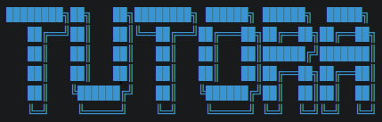

<div align="center">


<br/><br/>

# 🦉 TUTORA
### Academic Tutoring Platform

*A desktop application connecting students and tutors across Music, Photography, Sport and more.*

**Alessio Dainelli · Vittorio Iozzia** — Software Engineering & Web Design (ISPW) 2025/2026

---

</div>

## 📖 Overview

TUTORA is a Java desktop application that connects students and tutors on a single platform. Students can search for tutors, book lessons, apply to become tutors themselves, and leave reviews. Tutors manage their availability and respond to booking requests. An admin oversees quality by evaluating tutor applications.

The platform is available in **two interfaces** — a full JavaFX GUI and a CLI for terminal-based use — and supports **three persistence modes** switchable at startup with no code changes.

---

## ✨ Features

| Feature | Description |
|---|---|
| 🔍 **Tutor Search & Booking** | Browse and filter tutors by category, subcategory, price, and tags. Select a lesson slot and send a booking request. The tutor is notified and can accept or reject. |
| 📝 **Apply to Become a Tutor** | Submit a tutor application with supporting documents. Documents are validated via an external Certificate Validation API (3-minute timer). The admin reviews and notifies the applicant. |
| 🔔 **Notification System** | Role-aware notification panel updated in real time. Each notification may carry an executable action (pay a lesson, accept/reject a booking, approve/reject an application). |
| ⭐ **Reviews** | After a completed lesson, students can rate and review the tutor. Ratings are maintained automatically via SQL triggers. |
| 💳 **Payments** | Integrated PayPal payment flow triggered when a tutor accepts a booking request. |
| 💬 **Chat** | Direct messaging between students and tutors via TCP socket. |
| 🔐 **Session Management** | Concurrent user sessions handled via token-based mechanism (UUID). |
| 🌐 **Social Login** | OAuth 2.0 integration with Google and Meta. |
| 🖥️ **Dual Interface** | Full graphical interface (JavaFX) and a command-line interface (CLI), selectable at startup. |

---

## 🏗️ Architecture

The system follows the **Model-View-Controller (MVC)** architectural pattern with a layered separation between the presentation layer (GFX/CLI controllers), the business logic layer (Application Controllers), and the data access layer (DAO with Abstract Factory).

### 🧩 Design Patterns

| Pattern | Category | Where it is used |
|---|---|---|
| **Singleton** | Creational | `DaoFactory` (Bill Pugh Holder), `SessionManager`, `ConnectionFactory`, `SceneManager` |
| **Abstract Factory** | Creational | `DaoFactory` — three concrete implementations: `DbDaoFactory`, `DemoDaoFactory`, `JsonDaoFactory` |
| **Builder** | Creational | `User`, `Student`, `Tutor`, `Admin`, `Booking`, `Lesson`, `Message`, `Notification`, `Review` |
| **Adapter** | Structural | `PayPalBoundary`, `GoogleAuthBoundary`, `MetaAuthBoundary`, `CertificateValidationBoundary` |
| **Decorator** | Structural | `DashboardDecorator` — concrete decorators: `StudentDashboardDecorator`, `TutorDashboardDecorator`, `AdminDashboardDecorator` |
| **Observer** | Behavioural | `TutorApplication`, `Booking`, `Lesson`, `TutorExpertise` — push model via `java.beans.PropertyChangeSupport` |
| **MVC** | Architectural | View (GFX/CLI controllers) → Application Controllers → Model/DAO |

---

## 🗄️ Persistence Modes

One line in `app.properties` switches the entire persistence layer — no code changes required.

```properties
# Choose one: DB | DEMO | JSON
DAO_TYPE=DEMO
```

| Mode | Description | DB Required |
|---|---|---|
| 🟢 `DEMO` | In-memory data hardcoded in `DemoDaoFactory`. Ideal for demos and GUI testing. | No |
| 🟡 `JSON` | Reads and writes JSON files on disk. Data persists between sessions. | No |
| 🔵 `DB` | Full MySQL persistence via JDBC. Production mode. | Yes |

---

## ⚙️ Requirements

**💻 Software**

- ☕ JDK 17+
- 📦 Maven 3.8+
- 🎨 JavaFX SDK 21
- 🐬 MySQL 8.0+ *(optional — the app also runs with Demo or JSON persistence)*
- 🐙 Git

**🎛️ Hardware**

- CPU: Multi-core (i5 / Ryzen 5 or equivalent)
- RAM: 8 GB minimum
- Disk: 500 MB free space
- Display: 1366×768 minimum
- Network: Internet connection *(required for PayPal and OAuth flows)*

---

## 🚀 Getting Started

**1️⃣ Clone the repository**

```bash
git clone https://github.com/vittorio-iozzia/TUTORA_ISPW.git
cd TUTORA_ISPW
```

**2️⃣ Set up the database** *(only for DB mode)*

Make sure MySQL is running, then import the schema:

```bash
mysql -u root -p < database/TUTORA_db.sql
```

> ℹ️ This creates the database with all tables, indexes, foreign keys, and sample data.
> If your MySQL instance uses different credentials, update `src/main/resources/db.properties` before launching.

**3️⃣ Build and run**

```bash
mvn clean install
```

Then launch the application:

**🪟 Windows** *(recommended — ensures correct Unicode rendering in the CLI banner)*
```bat
.\avvia.bat
```

**🐧 macOS / Linux**
```bash
mvn javafx:run
```

***At startup you will be prompted to choose the interface and persistence mode:***
```
  Select interface:
    1) Graphical (JavaFX)
    2) Text-based (CLI)

  Select persistence mode:
    1) Demo  (in-memory, no DB required)
    2) JSON  (file on disk)
    3) DB    (MySQL)
```

**⚡ Skip the prompt via CLI arguments**

* GUI with in-memory demo data (no DB needed):
```bash
mvn javafx:run -Djavafx.args="--ui=GFX --dao=DEMO"
```

* CLI with in-memory demo data:
```bash
mvn javafx:run -Djavafx.args="--ui=CLI --dao=DEMO"
```

* GUI with MySQL:
```bash
mvn javafx:run -Djavafx.args="--ui=GFX --dao=DB"
```

> ℹ️ On Windows, pass arguments via `avvia.bat` by editing the last line, or run `mvn javafx:run -Djavafx.args="..."` directly after setting `chcp 65001` in the same terminal.

---

## 🧪 Testing

Run all tests with:

```bash
mvn test
```

Tests are split into two suites:

**📦 `BookingApplicationDomain`** — Booking and tutor application logic
- Duplicate booking detection (pass and throw cases)
- Tutor application DAO persistence
- Application readiness check before submission
- FSM status transition validation (`DRAFT → SUBMITTED → ACCEPTED/REJECTED`)

**📦 `StudentReviewDomain`** — Review and student budget logic
- Duplicate review prevention
- Rating value validation
- Student budget deduction after payment
- Insufficient budget detection
- Budget boundary validation

---

## 📈 Code Quality

Monitored via **SonarCloud** — Project: `vittorio-iozzia_TUTORA_ISPW`

[](https://sonarcloud.io/project/overview?id=vittorio-iozzia_TUTORA_ISPW)

---

## 🎬 Demo Video

A walkthrough of the main features of TUTORA — login, tutor search, lesson booking, tutor application, and the admin dashboard.

> 📺 [Watch the demo video](https://your-video-link-here)

---

## 👨‍💻 Authors

**Alessio Dainelli** · **Vittorio Iozzia**

*🎓 Università degli Studi di Roma Tor Vergata — ISPW 2025/2026*

---

<div align="center">



<br/>

> *Enjoy the app, and happy learning!* 🎓

</div>
